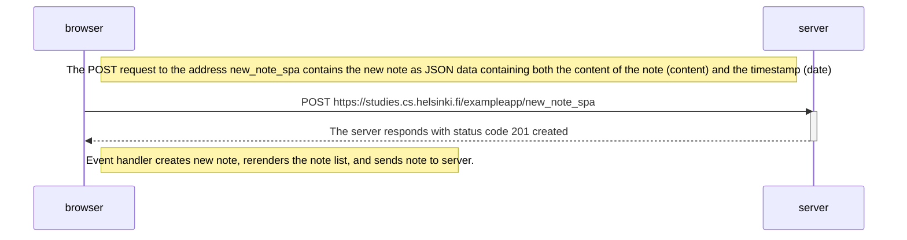

# Mermaid Diagram

```mermaid
sequenceDiagram
    participant browser
    participant server

    Note right of browser: The POST request to the address new_note_spa contains the new note as JSON data containing both the content of the note (content) and the timestamp (date)

    browser->>server: POST https://studies.cs.helsinki.fi/exampleapp/new_note_spa
    
    activate server
    server-->>browser: The server responds with status code 201 created
    deactivate server

    Note right of browser: Event handler creates new note, rerenders the note list, and sends note to server.
```